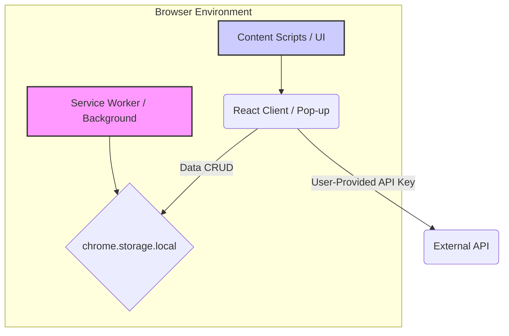

# ClerkFlow-Secure-Auth-Browser-Extension


**[⭐ Star ⭐ this Repo if you find it useful!]**

## :sparkles: Project Overview

ClerkFlow is a production-ready Manifest V3 browser extension boilerplate engineered for a frontend-only architecture. It integrates Clerk for secure user authentication and relies on user-provided API keys for all external services, ensuring that no backend is required. All data is persisted in the browser's local storage.

This repository serves as the definitive foundation for building robust, serverless web extensions that adhere to modern browser security standards.

## :dna: Architecture & Structure

This project is a pure frontend application, built with a modern **TypeScript/Vite** toolchain. The core is a fully contained, security-hardened extension bundle.



## :books: Table of Contents

1.  [Project Overview](#-project-overview)
2.  [Architecture & Structure](#-architecture--structure)
3.  [Tech Stack & Compliance](#-tech-stack--compliance)
4.  [Development Setup](#-development-setup)
5.  [Contribution Guidelines](#-contribution-guidelines)
6.  [Security & Licensing](#-security--licensing)

---

## :zap: Tech Stack & Compliance

This extension is built to the highest standards, prioritizing performance, strict typing, and modern browser policies (Manifest V3).

| Category          | Technology         | Rationale                                           |
| ----------------- | ------------------ | --------------------------------------------------- |
| **Core Language**   | TypeScript 6.x     | Strict typing enforces contract correctness.        |
| **Build Tool**      | Vite 7             | Rapid development, optimized bundling for extensions. |
| **Styling**         | TailwindCSS v4     | Utility-first, highly efficient styling pipeline.   |
| **Authentication**  | Clerk SDK          | Secure, managed OAuth/SSO authentication.           |
| **Data Persistence**| chrome.storage.local| Secure, in-browser data storage.                    |

## :construction: Development Setup

This boilerplate assumes Node.js (v20+) and npm are installed.

1.  **Clone Repository:**
    ```bash
    git clone https://github.com/chirag127/ClerkFlow-Secure-Auth-Browser-Extension.git
    cd ClerkFlow-Secure-Auth-Browser-Extension
    ```

2.  **Install Dependencies:**
    ```bash
    npm install
    ```

3.  **Run Development Server:**
    ```bash
    npm run dev
    ```

### Scripts

| Script        | Command       | Description                                                |
| ------------- | ------------- | ---------------------------------------------------------- |
| `dev`         | `npm run dev` | Starts Vite dev server with HMR for extension components.  |
| `build`       | `npm run build`| Compiles and bundles the extension for production/testing. |

## :handshake: Contribution Guidelines

Please see the dedicated [CONTRIBUTING.md](./CONTRIBUTING.md) for detailed instructions on submitting pull requests, reporting bugs, and setting up your development environment.

## :lock: Security & Licensing

### Security

Security is paramount. All authentication tokens related to Clerk sessions are handled exclusively within the isolated Service Worker context. User-provided API keys are stored securely in `chrome.storage.local`.

Please review our security policy at [SECURITY.md](./SECURITY.md).

### License

This project is licensed under the **Creative Commons Attribution-NonCommercial 4.0 International License (CC BY-NC 4.0)**. See the [LICENSE](./LICENSE) file for details.

---

*Built with Apex Authority standards.*
